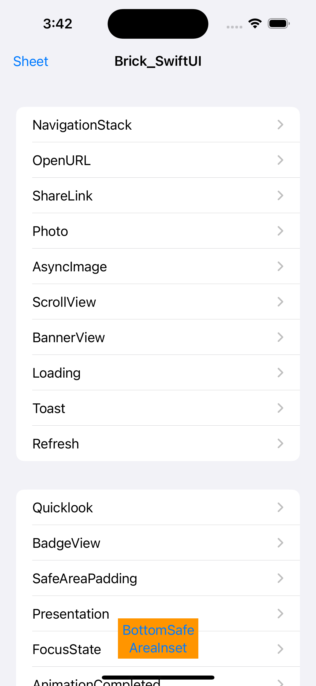
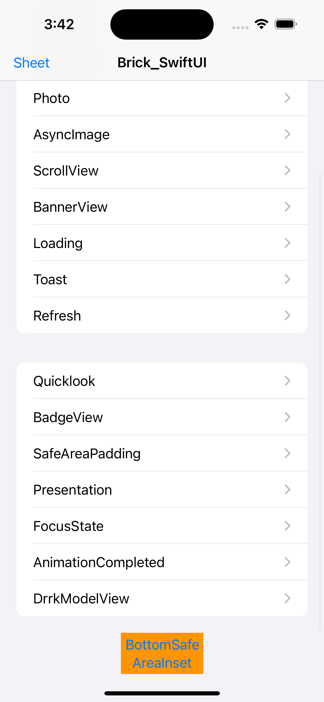

# Brick_SwiftUI

## [中文说明](https://github.com/jackiehu/Brick_SwiftUI/blob/main/README_ZH.md)

### SwiftUI APP Acceleration Development Kit

Built-in various auxiliary development tools, and the newly added API after iOS15 is compatible with iOS14, please run the demo to view the usage of specific functions

|  |  |
| ---------------- | ---------------- |
|                  |                  |

支持iOS14

- [x] AsyncImage

- [x] Camera (take a photo to get a photo)

- [x] CarouselView (infinite scrolling banner )

- [x] Feedback (Vibration button sound feedback )

- [x] Loading 

- [x] NavigationStack

- [x] OpenUrl

- [x] PhotoPicker

- [x] Presentation

- [x] Refresh

- [x] ScrollStack

- [x] ScrollView

- [x] ShareLink

- [x] Toast

- [x] Badge

- [x] Corner

- [x] @AppStorage extension
- [x] Color extension
- [x] View added vibration feedback
- [x] RoundedCorner extension
- [x] Spacer extension
- [x] WebView
- [x] Angle extension
- [x] Binding extension
- [x] Font extension
- [x] ForEach extension
- [x] GridItem extension
- [x] Image extension
- [x] Label extension
- [x] List extension
- [x] NavigationLink extension
- [x] Section extension
- [x] SecureField extension
- [x] Shape extension
- [x] Text extension
- [x] View extension

## Usage

## Install

### Cocoapods

1. Add `pod 'Brick_SwiftUI'` in Podfile

2. Execute `pod install or pod update`

3. Import `import Brick_SwiftUI`

### Swift Package Manager

Starting from Xcode 11, the Swift Package Manager is integrated, which is very convenient to use. Brick_SwiftUI also supports integration via Swift Package Manager.

Select `File > Swift Packages > Add Pacakage Dependency` in Xcode's menu bar, and enter in the search bar

`https://github.com/jackiehu/Brick_SwiftUI`, you can complete the integration

### Manual Install

Brick_SwiftUI also supports manual Install, just drag the Brick_SwiftUI folder in the Sources folder into the project that needs to be installed

## Author

jackiehu, 814030966@qq.com

## More tools to speed up APP development

## 许可

Brick_SwiftUI is available under the MIT license. See the LICENSE file for more info.
