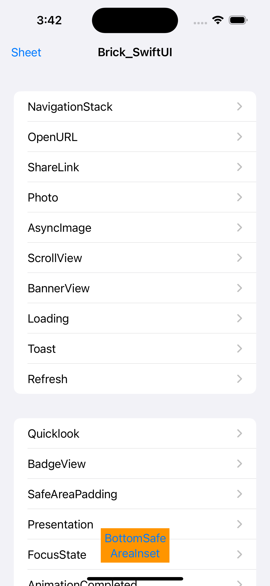
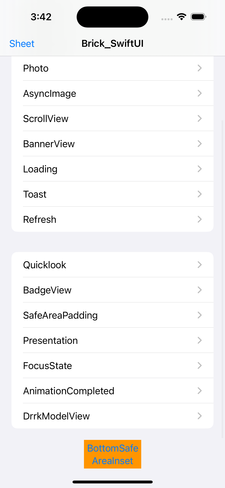

# Brick_SwiftUI

[](https://swift.org/package-manager/)


### SwiftUI APP 加速开发工具包

此项目与 [Gitee](https://gitee.com/zjinhu/brick) 相关联。如果你觉得在 SPM 中引入 GitHub 地址较慢，可以使用 Gitee。

内置多种辅助开发工具，iOS15 新增的 API 均已兼容 iOS14，具体功能用法请查看 demo

|  |  |
| ---------------- | ---------------- |
|                  |                  |

1.0.0 之前版本支持 iOS14，1.0.0 及之后版本使用 iOS16+Swift6.0

### Wrapped - View 扩展包装器

通过 `Brick<Wrapped>` 模式为 View 添加功能，使用 `view.ss.xxx` 调用

```swift
import Brick
// 使用方式
view.ss.tabBar(.hidden)
view.ss.onChange(of: value) { newValue in }
```

| 功能 | 说明 | 用法 |
|------|------|------|
| **TabbarVisible** | 控制 TabBar 显示/隐藏，支持动画 | `view.ss.tabBar(.hidden)` |
| **AppStore** | 生成 App Store 链接并展示应用推广页面 | `view.ss.showStoreProduct(appID: "123")` |
| **OnChange** | 统一的 onChange 处理，兼容 iOS 14-17 | `view.ss.onChange(of: value) { newValue in }` |
| **ShareSheet** | 自定义分享面板 | `ShareSheetView(activityItems: [...])` |
| **Checkmark** | 自定义复选框 toggle style | `view.ss.checkmark(.visible)` / `Toggle("Check", isOn: $bool).toggleStyle(.checkmark)` |
| **Geometry** | 几何变化检测与视觉特效 | `view.ss.onGeometryChange(for: CGSize.self, of: { $0.size }) { old, new in }` |
| **Badge** | 徽章叠加系统 | `view.ss.badge { Text("99+") }` |
| **BottomSafeArea** | 自定义底部安全区域插入 | `view.ss.bottomSafeAreaInset { SomeView() }` |
| **Border** | 边框修饰器 | `view.ss.border(.red, cornerRadius: 8, lineWidth: 2)` |
| **Background** | 背景修饰器，隐藏 List/TextView 背景 | `view.ss.background { Color.blue }` / `view.ss.hideListBackground()` |
| **Alignment** | 调整视图对齐方式 | `view.ss.alignmentGuideAdjustment(anchor: .topLeading)` |
| **CustomBackButton** | 自定义导航返回按钮 | `view.ss.navigationCustomBackButton { Image(systemName: "chevron.left") }` |
| **Task** | 回退的 .task 修饰器 for iOS 14- | `view.ss.task { await doSomething() }` |
| **TabbarColor** | 设置 TabBar 背景色 | `view.ss.tabbarColor(.white)` |
| **Submit** | 表单提交处理，自定义键盘返回键 | `view.ss.onSubmit { submit() }` / `view.ss.submitLabel(.done)` |
| **SafeArea** | 基于安全区域的应用填充 | `view.ss.safeAreaPadding(16)` |
| **OnTapLocal** | 获取点击位置坐标 | `view.ss.onTapGesture { point in print(point) }` |
| **NavigationBarColor** | 设置导航栏背景色 | `view.ss.navigationBarColor(backgroundColor: .blue)` |
| **ListSpace** | 设置 List 分组间距 | `view.ss.listSectionSpace(20)` |
| **Hidden** | 条件视图隐藏，支持过渡动画 | `view.ss.hidden(isHidden, transition: .opacity)` |
| **PushTransition** | 边缘推送/弹出过渡 (iOS 16+) | `AnyTransition.ss.push(from: .leading)` |
| **Overlay** | 叠加修饰器 | `view.ss.overlay { SomeView() }` |
| **Section** | 回退的 Section 容器 for iOS 14- | `Brick.Section("Title") { content }` |
| **ProposedViewSize** | 提议视图尺寸结构体 | `ProposedViewSize.zero` / `.infinity` / `.unspecified` |
| **RequestReview** | 应用商店评价请求 | `@Environment(\.requestReview) var requestReview` |
| **Shadow** | 阴影修饰器 | `view.ss.shadow(color: .black, x: 0, y: 2, blur: 4)` |
| **NavigationTitle** | 导航标题与显示模式控制 | `view.ss.navigationTitle("Title", displayMode: .large)` |
| **Mask** | 反向蒙版，用于徽章效果 | `view.ss.invertedMask { Circle() }` |
| **Corner** | 特定圆角设置 | `view.ss.cornerRadius(10, corners: [.topLeft, .topRight])` |
| **Alert** | UIAlertController 按钮色调自定义 | `.alert("Title").ss.alertButtonTint(.white)` |

#### Wrapped 详细 API 用法

##### TabbarVisible - TabBar 可见性控制

```swift
// 控制 TabBar 显示/隐藏
view.ss.tabBar(.hidden)  // 隐藏 TabBar
view.ss.tabBar(.visible) // 显示 TabBar
```

##### OnChange - 值变化监听

```swift
// iOS 14-17 兼容的 onChange
view.ss.onChange(of: count) { newValue in
    print("New value: \(newValue)")
}

// 带初始值回调 (iOS 17+)
view.ss.onChange(of: value, initial: true) { oldValue, newValue in
    print("Changed from \(oldValue) to \(newValue)")
}

// 无参数闭包
view.ss.onChange(of: flag) {
    print("Flag changed")
}
```

##### Geometry - 几何变化检测

```swift
// 监听视图尺寸变化
view.ss.onGeometryChange(for: CGSize.self, of: { $0.size }) { oldSize, newSize in
    print("Size changed: \(oldSize) -> \(newSize)")
}

// 仅获取新值
view.ss.onGeometryChange(for: CGSize.self, of: { $0.size }) { newSize in
    print("New size: \(newSize)")
}

// 视觉特效
view.ss.visualEffect { anyView, proxy in
    someView
        .frame(width: proxy.size.width)
}
```

##### Badge - 徽章

```swift
// 基本徽章
view.ss.badge {
    Text("99+")
        .font(.caption)
        .foregroundColor(.white)
        .padding(4)
        .background(Color.red)
        .clipShape(Circle())
}

// 自定义配置
view.ss.badge(
    alignment: .topTrailing,
    anchor: UnitPoint(x: 0.3, y: 0.3),
    scale: 1.2,
    inset: 8
) {
    redCircle
}
```

##### Border - 边框

```swift
// 圆角矩形边框
view.ss.border(Color.blue, cornerRadius: 12, lineWidth: 2)

// 胶囊边框
view.ss.borderCapsule(Color.green, lineWidth: 1)

// 自定义形状边框
view.ss.border(LinearGradient(...), width: 3, cornerRadius: 8)
```

##### Task - 异步任务 (iOS 14-)

```swift
// 基础异步任务
view.ss.task {
    let data = await fetchData()
    print(data)
}

// 带优先级的任务
view.ss.task(priority: .background) {
    await heavyWork()
}

// 基于 ID 取消的任务 (值变化时重新执行)
view.ss.task(id: itemId) {
    await fetchItem(itemId)
}
```

##### Submit - 表单提交

```swift
// 提交动作
TextField("Enter text", text: $text)
    .ss.onSubmit {
        submitForm()
    }

// 提交标签 (键盘返回键)
TextField("Username", text: $username)
    .ss.submitLabel(.next)

TextField("Password", text: $password)
    .ss.submitLabel(.done)
```

##### SafeArea - 安全区域填充

```swift
// 统一填充
view.ss.safeAreaPadding(16)

// 指定边填充
view.ss.safeAreaPadding(.horizontal, 20)

// 使用 EdgeInsets
view.ss.safeAreaPadding(EdgeInsets(top: 8, leading: 16, bottom: 8, trailing: 16))
```

##### Hidden - 条件隐藏

```swift
// 简单隐藏
view.ss.hidden(isLoading)

// 带过渡动画
view.ss.hidden(isHidden, transition: .slide)
view.ss.hidden(isHidden, transition: .scale)
view.ss.hidden(isHidden, transition: .opacity)
```

##### Corner - 特定圆角

```swift
import UIKit

// 仅顶部圆角
view.ss.cornerRadius(10, corners: [.topLeft, .topRight])

// 仅底部圆角
view.ss.cornerRadius(10, corners: [.bottomLeft, .bottomRight])

// 仅左上角
view.ss.cornerRadius(10, corners: [.topLeft])
```

##### Shadow - 阴影

```swift
view.ss.shadow(color: .black.opacity(0.2), x: 0, y: 4, blur: 8)
```

##### Checkmark - 复选框

```swift
// 视图修饰器
view.ss.checkmark(.visible)

// Toggle 样式
Toggle(" Agree to terms", isOn: $agreed)
    .toggleStyle(.checkmark)
```

### SwiftUI - SwiftUI 类型扩展

- [x] **View++** - 通用 View 扩展: `.then()`, `.hidden()`, `.offset()`, `.fill()`, `.fit()`, `.hideKeyboard()`, `.tintColor()`
- [x] **ForEach++** - ForEach 增强: 索引访问、枚举支持、`.interleave()`, `.interdivided()`, `.interspaced()`
- [x] **View+Geometry** - 绑定视图几何: `bindSafeAreaInsets`, `bindSize`
- [x] **View+Haptic** - 触觉反馈: `HapticButton`, 点击/变更/选择反馈
- [x] **View+Frame** - 框架扩展: `.minWidth()`, `.maxWidth()`, `.height()`, `.width()`, `.readHeight()`, `.readWidth()`, `.squareFrame()`
- [x] **View+Mask** - 蒙版扩展: `.mask()`, `.masking()`, `.reverseMask()`
- [x] **View+Background** - 背景扩展: `PassthroughView`, `.backgroundFill()`
- [x] **Image++** - Image 扩展: `.symbol()`, `.resized()`, `.sizeToFit()`
- [x] **View+Conditionals** - 条件视图: `.enabled()`, `.hidden(if)`, `.visible(if)`
- [x] **Text++** - Text 扩展
- [x] **Label++** - Label 扩展
- [x] **List++** - List 扩展
- [x] **Section++** - Section 扩展
- [x] **NavigationLink++** - NavigationLink 扩展
- [x] **Shape++** - Shape 扩展
- [x] **Spacer++** - Spacer 扩展
- [x] **Menu++** - Menu 扩展
- [x] **Angle++** - Angle 扩展
- [x] **Collection++** - Collection 扩展
- [x] **URL++** - URL 扩展
- [x] **String++** - String 扩展
- [x] **Task+** - Task 扩展
- [x] **GridItem++** - GridItem 扩展

### Tools - 工具组件

- [x] **NavigationStack** - 导航堆栈 (iOS 16-)
- [x] **Toast** - 提示框，支持位置(top/bottom)、动画类型(fade/slide/scale)
- [x] **ListPicker** - 通用列表选择器，支持分组、单选/多选
- [x] **TTextField** - 自定义样式文本字段，支持标题、占位符、错误状态
- [x] **CarouselView** - 水平轮播，支持缩放、循环、自动滚动
- [x] **FlipView** - 3D 翻转卡片视图
- [x] **OpenUrl** - URL 打开工具
- [x] **WebView** - WebView 组件
- [x] **Presentation** - 演示控件: DragIndicator, Detents, InteractiveDismiss, ContentInteraction, CornerRadius
- [x] **TextEditors** - TextEditor 样式扩展
- [x] **UnderLineText** - 下划线文本输入

### Utilities - 核心工具

- [x] **Brick** - 核心包装类型 `Brick<Wrapped>`
- [x] **SFSymbols** - SF Symbol 类型安全封装 (V1-V7)
- [x] **Keyboard** - 键盘管理，跟踪键盘高度
- [x] **Color+** - 颜色扩展，Hex 初始化、动态颜色、随机颜色
- [x] **UIColor++** - UIColor 扩展
- [x] **UIView++** - UIView 扩展
- [x] **Screen++** - 屏幕尺寸扩展
- [x] **CGSize++** - CGSize 扩展
- [x] **Image+** - 图片扩展
- [x] **Adapter** - 适配器工具
- [x] **CurrentLanguage** - 当前语言检测
- [x] **Application** - 应用信息
- [x] **BrickLog** - 日志工具
- [x] **ViewLifeCycle** - 视图生命周期: onFirstAppear, didDisappear, willDisappear

## 使用方法


## 安装

### Swift Package Manager

从 Xcode 11 开始，Swift Package Manager 已集成，使用非常方便。Brick_SwiftUI 也支持通过 Swift Package Manager 集成。

在 Xcode 菜单栏中选择 `File > Swift Packages > Add Package Dependency`，在搜索栏中输入

`https://github.com/jackiehu/Brick_SwiftUI`，即可完成集成

### 手动安装

Brick_SwiftUI 也支持手动安装，只需将 Sources 文件夹中的 Brick_SwiftUI 文件夹拖入需要安装的项目即可


## 作者

jackiehu, 814030966@qq.com

## 更多加速 APP 开发的工具

[](https://github.com/jackiehu/SwiftMediator)

[](https://github.com/jackiehu/SwiftBrick)

[](https://github.com/jackiehu/SwiftLog)

[](https://github.com/jackiehu/SwiftMesh)

[](https://github.com/jackiehu/SwiftNotification)


## 许可证

Brick_SwiftUI 基于 MIT 许可证发布。详细信息请查看 LICENSE 文件。
